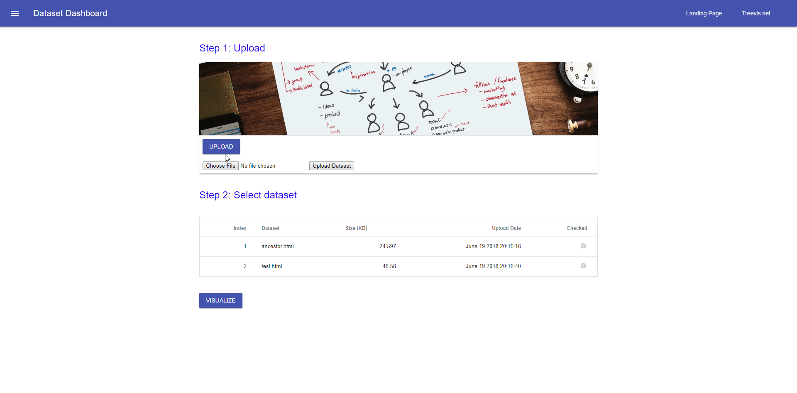

# NewSualizer
Tool that visualizes hierarchical newick (Standard for representing trees) datasets, built as a web app.
Can support large datasets (300k+ elements).
Written in Python and JavaScript on the back-end.

## Features
* Linking
* Brushing
* Selection tools
* Viewing tools

